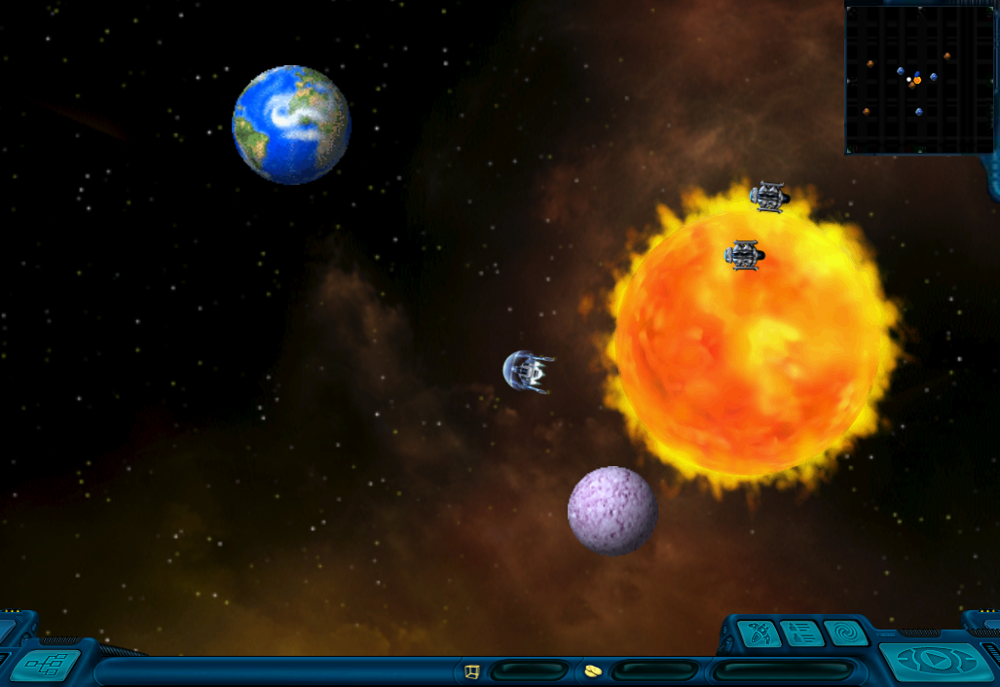
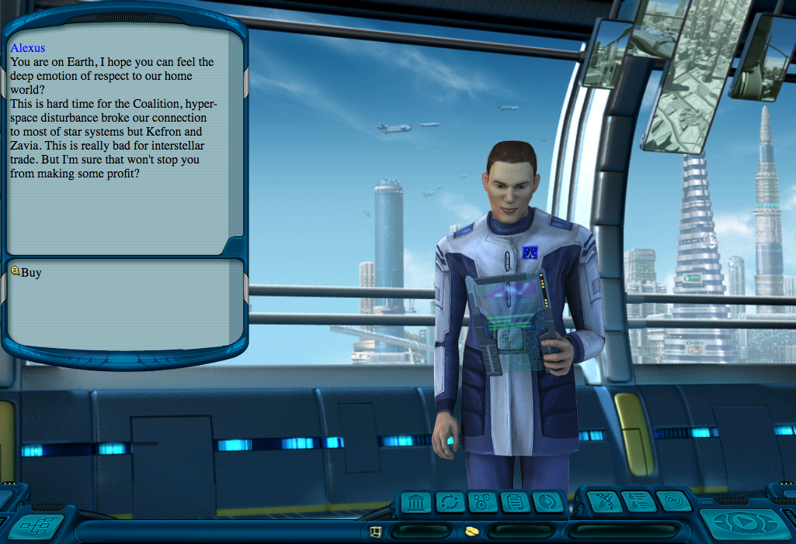
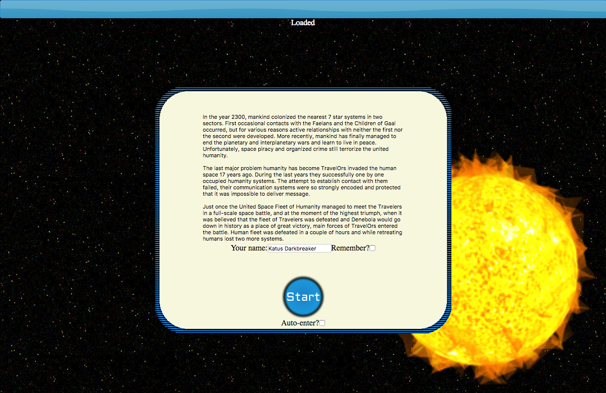
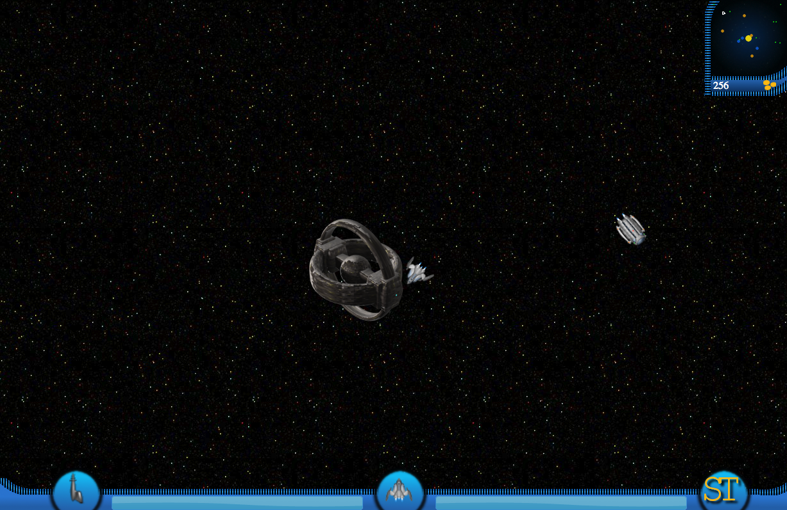
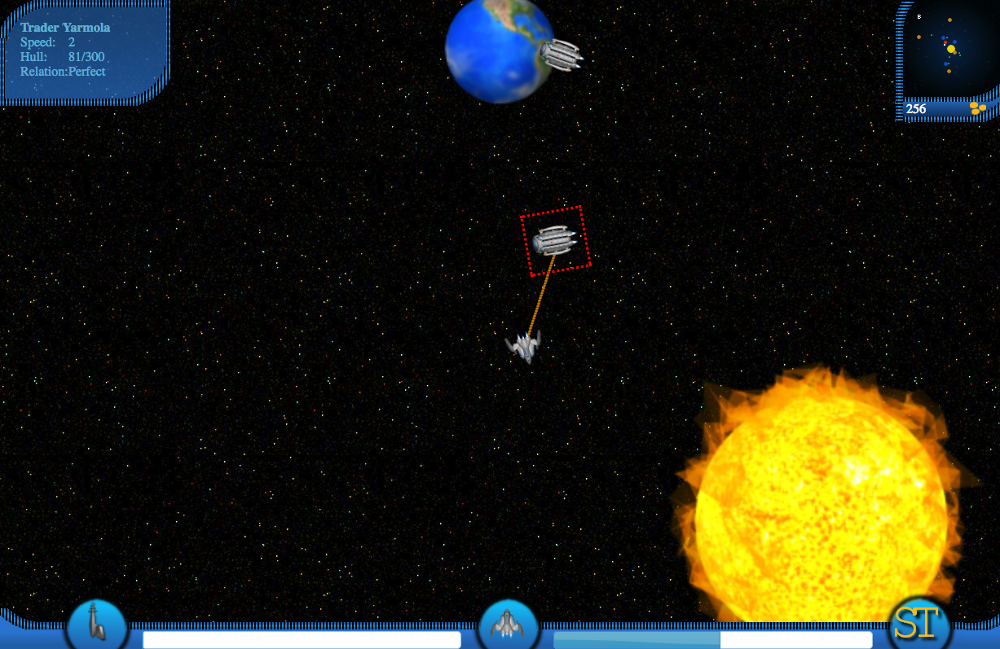
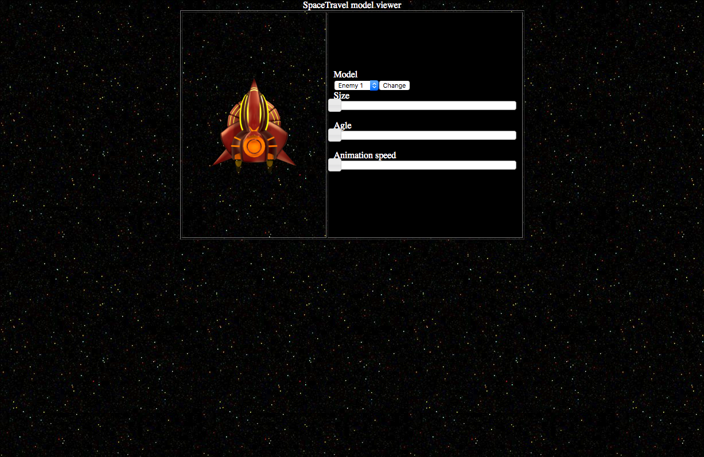

# Browser Space Travel game

Browser game I developed in 2010-2011. I was trying to create Space Rangers 2: Dominators in browser.
There are two versions, one that use graphics from Space Rangers 2: Dominators and another one with original graphics created by Andrey Aleev.

## Recoalition (SR2 resources)

This version is mostly based on graphics scraped from Space Rangers 2. Animation, movement are based on DOM tree and css. Uses browser side SQL DB. You can fly using WASD keys, navigate by mini-map in top right corner. You can land on Earth, position your ship over it and click Earth with cursor.

There was a version that allowed up to 5 players to play online, client side is lost, but server side is in server.php.

Loading of resources can take some time and there are no preloader, so please be patient.

Live version available here:
https://alexuslab.com/space-travel-game/recoalition/

## Space Travel (original resources)

Later it was decided to create game inspired by Space Rangers but completely original with own graphics. Huge thanks for a hard job done by Andrey Aleev, who made all of the models and UI elements. 

You can fly using WASD keys, navigate by mini-map in top right corner. You can select other ships clicking on them. By right click you also can shoot at other ships and destoy them.

Few versions of game launcher were created:
- original one in [index.html file](https://alexuslab.com/space-travel-game/space-travel/)
- canvas based test launcher in [index-canvas.html](https://alexuslab.com/space-travel-game/space-travel/index-canvas.html)
- launcher with js code in external files [index-ext-js.html](https://alexuslab.com/space-travel-game/space-travel/index-ext-js.html)

Additonal development tools were created:
- [Model animation viewer](https://alexuslab.com/space-travel-game/space-travel/model-viewer.html)
- [Orbit calculator](https://alexuslab.com/space-travel-game/space-travel/orbit-calculator.html)

## Recoalition screenshots

## Space Travel screenshots

